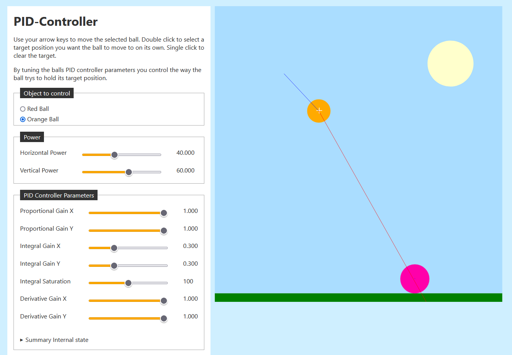

[Live Demo](https://static.laszlokorte.de/pid/)

# PID-Controller

Use your arrow keys to move the selected ball. Double click to select a target position you want the ball to move to on its own. Single click to clear the target.

By tuning the balls PID controller parameters you control the way the ball trys to hold its target position.